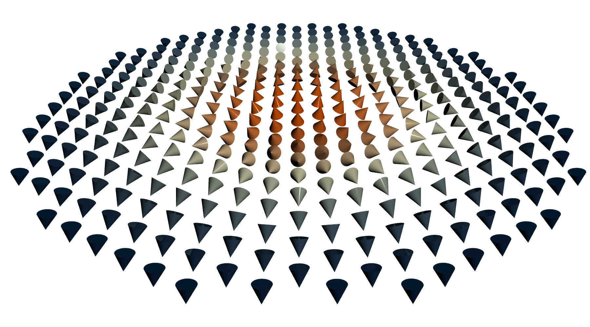

# Povray Vector Field

These scripts generate a vector field using Povray and Python.  The spins
directions are colourised according to their out of plane direction, using
Matplotlib.

The files are:

1. **generate_povray_inc.py**: This will generate a skyrmion (the vector field)
   using Fidimag and save the result to the **skyrmion.inc** file. This file
contains macros for each spin, called `spins`, which has 6 components: the 3
coordinates in space, the spins directions and the colours in rgb format.  We
provide the `.inc` file so we don't have to install Fidimag.

2. **generate_spins.pov**: This is the Povray file with the scene settings

3. **generate.ini**: Configurations to render the POV file

4. **Makefile**: Easily render the POV file with the corresponding settings and
   crop the final image file.

